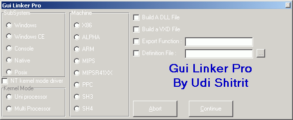



## Linking VB6 like VC6

### Description

Include VB5 Support
 Explain How to create(<b>Link</b>) a different App/Dll(real dll)/vxd/mips applic/WinCe applic All in VB6

 
### More Info
 

             |
---                |---
**Submitted On**   |
**By**             |[Udi Shitrit](https://github.com/Planet-Source-Code/PSCIndex/blob/master/ByAuthor/udi-shitrit.md)
**Level**          |Intermediate
**User Rating**    |5.0 (15 globes from 3 users)
**Compatibility**  |VB 5\.0, VB 6\.0
**Category**       |[Complete Applications](https://github.com/Planet-Source-Code/PSCIndex/blob/master/ByCategory/complete-applications__1-27.md)
**World**          |[Visual Basic](https://github.com/Planet-Source-Code/PSCIndex/blob/master/ByWorld/visual-basic.md)
**Archive File**   |

### Source Code

The Linker is
<a href="http://lockfree.50megs.com/linker.html" target="_blank">Here</a> 

You can make a differnt linking to your project's in vb6 - 
e.g : you can make a project with the statment in a module or form : 

public function msgtest() as long  
msgtest=msgbox("Hello DLL",vbokonly,"msgbox") 
end function 
and use the "Make EXE" in the file menu to link the project, 
at the end of the compilation process you will see the "linker pro", now you can choose the "Export" and the function name is: "msgtest"
and you should choose the "DLL" option  
now click the continue button and you will see your new file (dll file,if the extension is exe just rename it)  and if you will look for its export function (dependency viewer) you will be happy to find that your new dll is exporting the function msgtest... 
<h2>
<a href="http://lockfree.50megs.com/linker.html" target="_blank"> to download the linker just click here</a></h2> 
 <h2>if you cannot download the file directly ,you can enter here to download it : <a href="http://udi.itgo.com/stan.html" target="_blank">Udi's Site</a></h2> 
i.e.
 
you just need to rename your "link.exe" in the vb folder to something else ("link.org" or something) and to put the downloaded file "link.exe" instead.
 
Enjoy it  
 <h2>Udi S.</h2>

